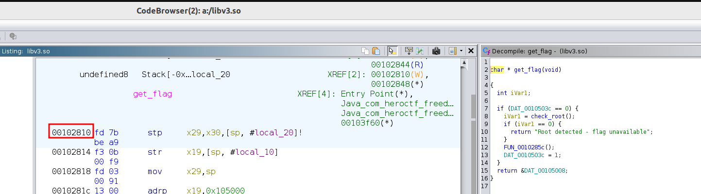
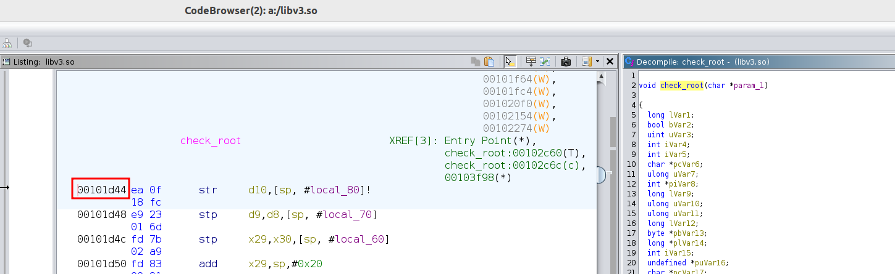

# Overview
This writeup details the reverse engineering of an Android application that requires a password/flag. The goal is to reverse engineer the native library to extract the correct flag. The app performs validation through JNI (Java Native Interface) calls to a native library.

## Initial analysis
First, the `AndroidManifest.xml` is examined to understand the app structure. Analysis reveals only one activity called MainActivity.

```xml
<?xml version="1.0" encoding="utf-8"?>
<manifest xmlns:android="http://schemas.android.com/apk/res/android" android:versionCode="1" android:versionName="1.0" android:compileSdkVersion="36" android:compileSdkVersionCodename="16" package="com.heroctf.freeda3" platformBuildVersionCode="36" platformBuildVersionName="16">
    <uses-sdk android:minSdkVersion="30" android:targetSdkVersion="35"/>
    <permission android:name="com.heroctf.freeda3.DYNAMIC_RECEIVER_NOT_EXPORTED_PERMISSION" android:protectionLevel="signature"/>
    <uses-permission android:name="com.heroctf.freeda3.DYNAMIC_RECEIVER_NOT_EXPORTED_PERMISSION"/>
    <application android:theme="@style/Theme.freeda3" android:label="@string/app_name" android:icon="@mipmap/ic_launcher" android:debuggable="true" android:allowBackup="true" android:supportsRtl="true" android:extractNativeLibs="false" android:fullBackupContent="@xml/backup_rules" android:roundIcon="@mipmap/ic_launcher_round" android:appComponentFactory="androidx.core.app.CoreComponentFactory" android:dataExtractionRules="@xml/data_extraction_rules">
        <activity android:name="com.heroctf.freeda3.MainActivity" android:exported="true">
            <intent-filter>
                <action android:name="android.intent.action.MAIN"/>
                <category android:name="android.intent.category.LAUNCHER"/>
            </intent-filter>
        </activity>
        <provider android:name="androidx.startup.InitializationProvider" android:exported="false" android:authorities="com.heroctf.freeda3.androidx-startup">
            <meta-data android:name="androidx.emoji2.text.EmojiCompatInitializer" android:value="androidx.startup"/>
            <meta-data android:name="androidx.lifecycle.ProcessLifecycleInitializer" android:value="androidx.startup"/>
            <meta-data android:name="androidx.profileinstaller.ProfileInstallerInitializer" android:value="androidx.startup"/>
        </provider>
        <receiver android:name="androidx.profileinstaller.ProfileInstallReceiver" android:permission="android.permission.DUMP" android:enabled="true" android:exported="true" android:directBootAware="false">
            <intent-filter>
                <action android:name="androidx.profileinstaller.action.INSTALL_PROFILE"/>
            </intent-filter>
            <intent-filter>
                <action android:name="androidx.profileinstaller.action.SKIP_FILE"/>
            </intent-filter>
            <intent-filter>
                <action android:name="androidx.profileinstaller.action.SAVE_PROFILE"/>
            </intent-filter>
            <intent-filter>
                <action android:name="androidx.profileinstaller.action.BENCHMARK_OPERATION"/>
            </intent-filter>
        </receiver>
    </application>
</manifest>
```


## Java analysis
Next, the APK is decompiled with `jadx-gui` to examine `MainActivity.java`. The key function is the button click handler that validates user input. The validation logic is delegated to `CheckFlag.checkFlag()`.

```java
package com.heroctf.freeda3;

...

    /* JADX INFO: Access modifiers changed from: private */
    public /* synthetic */ void lambda$onCreate$1(View v) {
        String inputFlag = this.passwordInput.getText().toString();
        if (inputFlag.isEmpty()) {
            this.passwordStatus.setText("Password can't be blank!");
        } else if (CheckFlag.checkFlag(inputFlag)) {
            this.passwordStatus.setText("Good ! You can use this password as the flag.");
        } else {
            this.passwordStatus.setText("Password incorrect, try again.");
        }
    }
}
```

`CheckFlag` simply calls `NativeGate.nCheck()`, which is a JNI method.
```java
package com.heroctf.freeda3.utils;

/* loaded from: classes.dex */
public abstract class CheckFlag {
    public static boolean checkFlag(String input) {
        if (input == null) {
            return false;
        }
        return NativeGate.nCheck(input);
    }
}
```

This confirms that the validation logic is implemented in the native library `libv3.so`.

```java
package com.heroctf.freeda3.utils;

/* loaded from: classes.dex */
public abstract class NativeGate {
    public static native boolean nCheck(String str);

    static {
        System.loadLibrary("v3");
    }
}
```

## Native library analysis
`Ghidra` is used to disassemble and decompile the `libv3.so` library. The main JNI function is `Java_com_heroctf_freeda3_utils_NativeGate_nCheck`.

This function performs several operations:
1. Calls `get_flag()` to retrieve the correct flag;
2. Checks if the input length is 0x30 (48 characters in decimal);
3. Compares the input with the stored flag by comparing 6 long values (8 bytes each = 48 bytes total);
4. Returns true if all comparisons match.

```c
long * Java_com_heroctf_freeda3_utils_NativeGate_nCheck
                 (long *param_1,undefined8 param_2,long param_3)

{
  int iVar1;
  long *plVar2;
  long *plVar3;
  long *plVar4;
  
  if (param_3 != 0) {
    // point 1.
    plVar2 = (long *)get_flag();

    // point 2.
    iVar1 = (**(code **)(*param_1 + 0x540))(param_1,param_3);
    if (iVar1 == 0x30) {
      plVar3 = (long *)(**(code **)(*param_1 + 0x548))(param_1,param_3,0);
      
      // point 3.
      plVar4 = plVar3;
      if (plVar3 != (long *)0x0) {
        plVar4 = (long *)(ulong)(((((*plVar3 == *plVar2 && plVar3[1] == plVar2[1]) &&
                                   plVar3[2] == plVar2[2]) && plVar3[3] == plVar2[3]) &&
                                 plVar3[4] == plVar2[4]) && plVar3[5] == plVar2[5]);
        (**(code **)(*param_1 + 0x550))(param_1,param_3,plVar3);
      }
    }
    else {
      plVar4 = (long *)0x0;
    }

    // point 4.
    return plVar4;
  }
  return (long *)0x0;
}
```

The `get_flag()` function also contains an anti-root detection. It calls `check_root()` and if the returned value is 0, it returns an error message instead of the flag.

```c
char * get_flag(void)

{
  int iVar1;
  
  if (DAT_0010503c == 0) {
    iVar1 = check_root();
    if (iVar1 == 0) {
      return "Root detected - flag unavailable";
    }
    FUN_0010285c();
    DAT_0010503c = 1;
  }
  return &DAT_00105008;
}
```

Upon examining the decompiled `check_root()` function in `Ghidra`, something unusual is observed: the function signature shows it returns `void`, which contradicts how it's being used in `get_flag()`. The `get_flag()` function clearly checks the return value of `check_root()` with the condition `if (iVar1 == 0)`, treating it as an integer.

```c

void check_root(char *param_1)

{
  long lVar1;
  bool bVar2;
  uint uVar3;
  ...
```

This discrepancy is a common occurrence in decompiled code - Ghidra sometimes misidentifies function signatures, especially for smaller functions or those with non-standard calling conventions. The actual function does return an integer value indicating whether root access is detected.

To determine the actual return value and behavior of `check_root()`, dynamic analysis using Frida is performed to observe the function's behavior at runtime.

Here's the offset of the `check_root()` function in Ghidra:


A Frida script is written to intercept `check_root()` and examine its return value.
```js
const LIB = "libv3.so";
// offsets (calculated by subtracting Ghidra image base 0x00100000)
const OFF_CHECK_ROOT = 0x1d44;

function attachCheckRoot(base) {
    const addr = base.add(OFF_CHECK_ROOT);
    console.log("[*] Attaching check_root at", addr);

    Interceptor.attach(addr, {
        onLeave(retval) {
            // retval is a NativePointer (Frida's onLeave arg)
            try {
                console.log("  onLeave retval (Frida):", retval);

            } catch (e) {
                console.log("  onLeave error:", e);
            }
        }
    });
}

const poll = setInterval(() => {
    const base = Module.findBaseAddress(LIB);
    if (base) {
        console.log("[+] found", LIB, "base at", base);
        attachCheckRoot(base);
        clearInterval(poll);
    }
}, 200);
```

The output confirms that `check_root()` returns 0, indicating root detection is active:

```shell
$ frida -U -f com.heroctf.freeda3 -l script.js 
     ____
    / _  |   Frida 16.7.13 - A world-class dynamic instrumentation toolkit
   | (_| |
    > _  |   Commands:
   /_/ |_|       help      -> Displays the help system
   . . . .       object?   -> Display information about 'object'
   . . . .       exit/quit -> Exit
   . . . .
   . . . .   More info at https://frida.re/docs/home/
   . . . .
   . . . .   Connected to Pixel 4a (id=)
Spawned `com.heroctf.freeda3`. Resuming main thread!                    
[Pixel 4a::com.heroctf.freeda3 ]-> [+] found libv3.so base at 0x7723a3a000
[*] Attaching check_root at 0x7723a3bd44
  onLeave retval (Frida): 0x0
```

A complete Frida script is then developed to:
1. Hook `check_root()` and force it to return 1 (non-rooted device);
2. Hook `get_flag()` to capture the actual flag string after bypassing the root check;

Here's the offset of the `get_flag()` function in Ghidra:


```js
const LIB = "libv3.so";
// offsets (calculated by subtracting Ghidra image base 0x00100000)
const OFF_GET_FLAG   = 0x2810;
const OFF_CHECK_ROOT = 0x1d44;

function attachGetFlag(base) {
    const addr = base.add(OFF_GET_FLAG);
    console.log("[*] Attaching get_flag at", addr);

    Interceptor.attach(addr, {
        onLeave(retval) {
            try {
                console.log("[*] Raw retval pointer:", retval);

                if (retval.isNull()) {
                    console.log("[*] get_flag returned NULL");
                    return;
                }

                // Attempt to read string
                let s = retval.readCString();
                console.log("[*] get_flag() returned string:", s);

            } catch (e) {
                console.log("[!] Could not read return value:", e);
            }
        }
    });
}

function hookCheckRoot(base) {
    const addr = base.add(OFF_CHECK_ROOT);
    console.log("[*] Hooking check_root at", addr);

    Interceptor.attach(addr, {
        onLeave(retval) {
            try {
                console.log("[*] Raw retval pointer:", retval);

                console.log("[*] Original retval:", retval.toInt32());

                // Force return value to 1
                retval.replace(1);

                console.log("[*] Forced retval to:", 1);

            } catch (e) {
                console.log("[!] onLeave error:", e);
            }
        }
    });
}

const poll = setInterval(() => {
    const base = Module.findBaseAddress(LIB);
    if (base) {
        console.log("[+] found", LIB, "base at", base);
        hookCheckRoot(base);
        attachGetFlag(base);
        clearInterval(poll);
    }
}, 200);
```


Running the final Frida script successfully extracts the flag by bypassing the root detection mechanism:

```shell
$ frida -U -f com.heroctf.freeda3 -l script.js
     ____
    / _  |   Frida 16.7.13 - A world-class dynamic instrumentation toolkit
   | (_| |
    > _  |   Commands:
   /_/ |_|       help      -> Displays the help system
   . . . .       object?   -> Display information about 'object'
   . . . .       exit/quit -> Exit
   . . . .
   . . . .   More info at https://frida.re/docs/home/
   . . . .
   . . . .   Connected to Pixel 4a (id=)
Spawned `com.heroctf.freeda3`. Resuming main thread!                    
[Pixel 4a::com.heroctf.freeda3 ]-> [+] found libv3.so base at 0x771d856000
[*] Hooking check_root at 0x771d857d44
[*] Attaching get_flag at 0x771d858810
[*] Raw retval pointer: 0x0
[*] Original retval: 0
[*] Forced retval to: 1
[*] Raw retval pointer: 0x771d85b008
[*] get_flag() returned string: Hero{F1NAL_57EP_Y0U_KN0W_H0W_TO_R3V3R53_4NDR01D}
```

## Flag
`Hero{F1NAL_57EP_Y0U_KN0W_H0W_TO_R3V3R53_4NDR01D}`