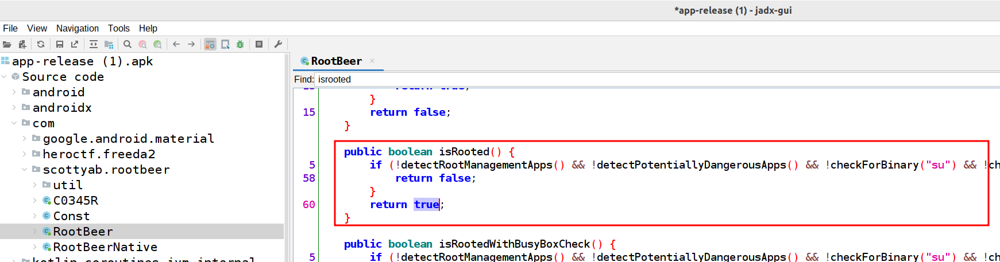
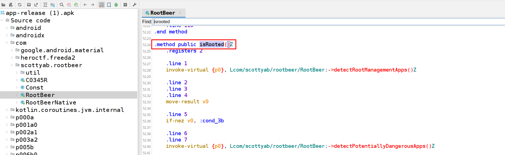
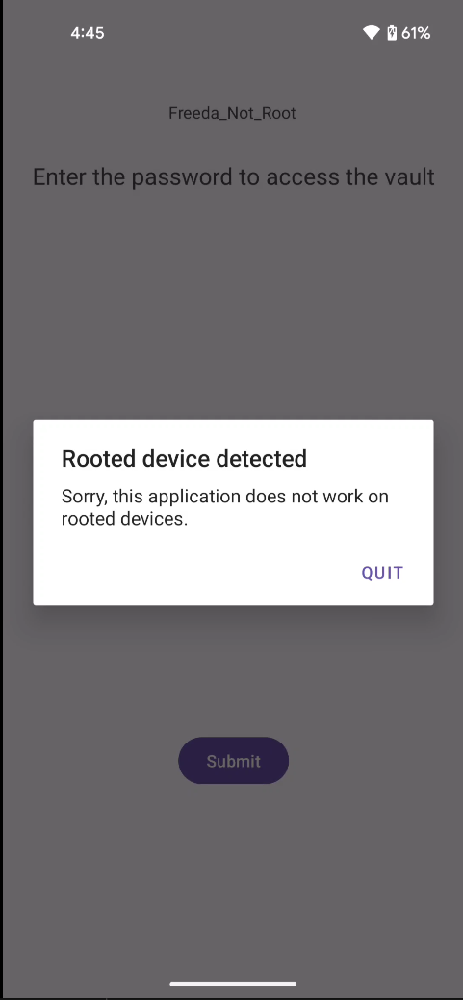
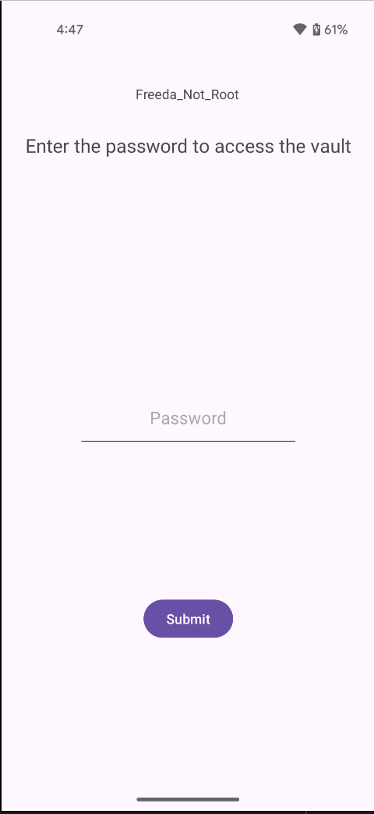

# Overview
This writeup details the reverse engineering of an Android application that requires a password input. The goal is to reverse engineer the flag validation mechanism and extract the correct flag by bypassing root detection and analyzing the reflection-based obfuscation.

## Initial analysis
First, the `AndroidManifest.xml` is examined to understand the app structure. Analysis reveals only one activity called MainActivity.

```xml
<?xml version="1.0" encoding="utf-8"?>
<manifest xmlns:android="http://schemas.android.com/apk/res/android" android:versionCode="1" android:versionName="1.0" android:compileSdkVersion="36" android:compileSdkVersionCodename="16" package="com.heroctf.freeda2" platformBuildVersionCode="36" platformBuildVersionName="16">
    <uses-sdk android:minSdkVersion="30" android:targetSdkVersion="35"/>
    <permission android:name="com.heroctf.freeda2.DYNAMIC_RECEIVER_NOT_EXPORTED_PERMISSION" android:protectionLevel="signature"/>
    <uses-permission android:name="com.heroctf.freeda2.DYNAMIC_RECEIVER_NOT_EXPORTED_PERMISSION"/>
    <application android:theme="@style/Theme.Freeda2" android:label="@string/app_name" android:icon="@mipmap/ic_launcher" android:allowBackup="true" android:supportsRtl="true" android:extractNativeLibs="false" android:fullBackupContent="@xml/backup_rules" android:roundIcon="@mipmap/ic_launcher_round" android:appComponentFactory="androidx.core.app.CoreComponentFactory" android:dataExtractionRules="@xml/data_extraction_rules">
        <activity android:name="com.heroctf.freeda2.MainActivity" android:exported="true">
            <intent-filter>
                <action android:name="android.intent.action.MAIN"/>
                <category android:name="android.intent.category.LAUNCHER"/>
            </intent-filter>
        </activity>
        <provider android:name="androidx.startup.InitializationProvider" android:exported="false" android:authorities="com.heroctf.freeda2.androidx-startup">
            <meta-data android:name="androidx.emoji2.text.EmojiCompatInitializer" android:value="androidx.startup"/>
            <meta-data android:name="androidx.lifecycle.ProcessLifecycleInitializer" android:value="androidx.startup"/>
            <meta-data android:name="androidx.profileinstaller.ProfileInstallerInitializer" android:value="androidx.startup"/>
        </provider>
        <receiver android:name="androidx.profileinstaller.ProfileInstallReceiver" android:permission="android.permission.DUMP" android:enabled="true" android:exported="true" android:directBootAware="false">
            <intent-filter>
                <action android:name="androidx.profileinstaller.action.INSTALL_PROFILE"/>
            </intent-filter>
            <intent-filter>
                <action android:name="androidx.profileinstaller.action.SKIP_FILE"/>
            </intent-filter>
            <intent-filter>
                <action android:name="androidx.profileinstaller.action.SAVE_PROFILE"/>
            </intent-filter>
            <intent-filter>
                <action android:name="androidx.profileinstaller.action.BENCHMARK_OPERATION"/>
            </intent-filter>
        </receiver>
    </application>
</manifest>
```

## Java analysis
Next, the APK is decompiled with `jadx-gui` to examine `MainActivity.java`. The `onCreate` method reveals that the application performs root detection using the `Security.detectRoot()` method. If root is detected, the application displays a warning message.

```java
package com.heroctf.freeda2;

...
        AbstractC0681b0.m669u(findViewById, c0041i03);
        if (Security.detectRoot(getApplicationContext())) {
            runOnUiThread(new RunnableC0047n(8, this));
        }
        this.f1909D = (Button) findViewById(C0345R.C0347id.submitButton);
        this.f1910E = (EditText) findViewById(C0345R.C0347id.flagInput);
        this.f1911F = (TextView) findViewById(C0345R.C0347id.passwordStatus);
        this.f1909D.setOnClickListener(new View$OnClickListenerC0319n(4, this));
    }
}
```

The `Security` class uses the `RootBeer` library to detect rooted devices.

```java
package com.heroctf.freeda2.utils;

import android.content.Context;
import com.scottyab.rootbeer.RootBeer;

/* compiled from: r8-map-id-baa4c77f810b701c3077d4ce68a3d5b79ee91034c03e266e8ba1aed7e464c1a1 */
/* loaded from: classes.dex */
public final class Security {
    private Security() {
    }

    public static boolean detectRoot(Context context) {
        return new RootBeer(context).isRooted();
    }
}
```

The button's click listener at the end of the `MainActivity.java` handles flag validation. It retrieves the user input and passes it to `CheckFlag.checkFlag()` for verification.

```java
package com.google.android.material.datepicker;

...
            default:
                MainActivity mainActivity = (MainActivity) obj;
                String obj2 = mainActivity.f1910E.getText().toString();
                if (obj2.isEmpty()) {
                    mainActivity.f1911F.setText("Password can't be blank!");
                    return;
                } else if (CheckFlag.checkFlag(obj2)) {
                    mainActivity.f1911F.setText("Good ! You can use this password as the flag.");
                    return;
                } else {
                    mainActivity.f1911F.setText("Password incorrect, try again.");
                    return;
                }
        }
    }
}
```

The `CheckFlag` class reveals an interesting obfuscation technique: Java reflection is used to dynamically invoke the `get_flag()` method from the `Vault` class. This is a common anti-static-analysis technique that makes it harder to trace the code flow during decompilation, as the method calls are resolved at runtime rather than being explicit in the bytecode.

```java
package com.heroctf.freeda2.utils;

import java.lang.reflect.Method;

/* compiled from: r8-map-id-baa4c77f810b701c3077d4ce68a3d5b79ee91034c03e266e8ba1aed7e464c1a1 */
/* loaded from: classes.dex */
public class CheckFlag {
    public static boolean checkFlag(String str) {
        if (str == null) {
            return false;
        }
        try {
            String str2 = "get_flag";
            Method declaredMethod = Class.forName("com.heroctf.freeda2.utils" + "." + "Vault").getDeclaredMethod(str2, null);
            declaredMethod.setAccessible(true);
            return ((String) declaredMethod.invoke(null, null)).equals(str);
        } catch (Throwable unused) {
            return false;
        }
    }
}
```

The `Vault` class contains the `get_flag()` method that returns the actual flag. However, analyzing this method statically would require significant effort due to potential obfuscation.

```java
package com.heroctf.freeda2.utils;

import java.lang.invoke.MethodHandle;
import java.lang.invoke.MethodHandles;
import java.lang.invoke.MethodType;
import java.lang.reflect.Constructor;
import java.nio.charset.Charset;

/* compiled from: r8-map-id-baa4c77f810b701c3077d4ce68a3d5b79ee91034c03e266e8ba1aed7e464c1a1 */
/* loaded from: classes.dex */
public final class Vault {
...
    public static String get_flag() {
    ...
```

A Frida script is developed to:
1. Bypass the `RootBeer` root detection by hooking `isRooted()` and forcing it to return false;
2. Hook the Java reflection API (`Method.invoke()`) to intercept calls to `Vault.get_flag()` and capture its return value;

The script specifically monitors reflection calls to detect when `get_flag()` is invoked dynamically, allowing extraction of the flag without needing to understand the internal implementation of the `Vault` class.

```js
function bypassRoot() {
    var RootBeer = Java.use('com.scottyab.rootbeer.RootBeer');

    RootBeer.isRooted.implementation = function () {
        console.log("[*] Setting RootBeer.isRooted() to false");
        return false;
    };
}

function hookGetFlag() {
    var Method = Java.use("java.lang.reflect.Method");

    Method.invoke.overload('java.lang.Object', '[Ljava.lang.Object;')
        .implementation = function (receiver, args) {

        if (this.getDeclaringClass().getName() === "com.heroctf.freeda2.utils.Vault" &&
            this.getName() === "get_flag") {

            console.log("[*] Vault.get_flag() called via reflection");

            var result = this.invoke(receiver, args);

            console.log("[*] FLAG =", result);

            return result;
        }

        return this.invoke(receiver, args);
    };
}

Java.perform(function () {
    bypassRoot();
    hookGetFlag();
});
```

Running the Frida script successfully bypasses root detection and intercepts the reflective call to `get_flag()`, revealing the flag:

```shell
$ frida -U -f com.heroctf.freeda2 -l script.js
     ____
    / _  |   Frida 16.7.13 - A world-class dynamic instrumentation toolkit
   | (_| |
    > _  |   Commands:
   /_/ |_|       help      -> Displays the help system
   . . . .       object?   -> Display information about 'object'
   . . . .       exit/quit -> Exit
   . . . .
   . . . .   More info at https://frida.re/docs/home/
   . . . .
   . . . .   Connected to Pixel 4a (id=)
Spawned `com.heroctf.freeda2`. Resuming main thread!                    
[Pixel 4a::com.heroctf.freeda2 ]-> [*] Setting RootBeer.isRooted() to false
[*] Vault.get_flag() called via reflection
[*] FLAG = HERO{D1D_Y0U_U53_0BJ3C71ON?}
```

## Flag
`HERO{D1D_Y0U_U53_0BJ3C71ON?}`


# Alternative solution with smali modification
Instead of using Frida to bypass root detection at runtime, an alternative approach is to permanently patch the APK by modifying its smali code. 

## Analyzing RootBeer implementation

The `RootBeer.isRooted()` method in Java performs multiple checks and returns `true` if any of them detect root access:


The corresponding smali bytecode shows the same logic at a lower level:


## Patching the APK
The `isRooted()` method in `RootBeer.smali` is examined. The method performs multiple root detection checks and branches to `:cond_1` and `:goto_0` labels if any check succeeds, ultimately returning `0x1 (true)` to indicate root detection:
```smali
.method public isRooted()Z
    .locals 1

    # ========== start multiple checks ==========

    # check detectRootManagementApps, store value in v0, jump to :cond_1 if not 0
    invoke-virtual {p0}, Lcom/scottyab/rootbeer/RootBeer;->detectRootManagementApps()Z
    move-result v0
    if-nez v0, :cond_1

    # ...
    invoke-virtual {p0}, Lcom/scottyab/rootbeer/RootBeer;->detectPotentiallyDangerousApps()Z
    move-result v0
    if-nez v0, :cond_1

    const-string v0, "su"
    invoke-virtual {p0, v0}, Lcom/scottyab/rootbeer/RootBeer;->checkForBinary(Ljava/lang/String;)Z
    move-result v0
    if-nez v0, :cond_1

    invoke-virtual {p0}, Lcom/scottyab/rootbeer/RootBeer;->checkForDangerousProps()Z
    move-result v0
    if-nez v0, :cond_1

    invoke-virtual {p0}, Lcom/scottyab/rootbeer/RootBeer;->checkForRWPaths()Z
    move-result v0
    if-nez v0, :cond_1

    invoke-virtual {p0}, Lcom/scottyab/rootbeer/RootBeer;->detectTestKeys()Z
    move-result v0
    if-nez v0, :cond_1

    invoke-virtual {p0}, Lcom/scottyab/rootbeer/RootBeer;->checkSuExists()Z
    move-result v0
    if-nez v0, :cond_1

    invoke-virtual {p0}, Lcom/scottyab/rootbeer/RootBeer;->checkForRootNative()Z
    move-result v0
    if-nez v0, :cond_1

    invoke-virtual {p0}, Lcom/scottyab/rootbeer/RootBeer;->checkForMagiskBinary()Z
    move-result p0
    if-eqz p0, :cond_0
    goto :goto_0

    # ========== end multiple checks ==========

    # all checks failed, returning 0
    :cond_0
    const/4 p0, 0x0
    return p0

    # any check succeeded, returning 1
    :cond_1
    :goto_0
    const/4 p0, 0x1
    return p0
.end method
```

The patch is simple: change the return value at labels `:cond_1` and `:goto_0` from `0x1` (true) to `0x0` (false), effectively disabling root detection:

```
before:
    :cond_0
    const/4 p0, 0x0
    return p0

    :cond_1
    :goto_0
    const/4 p0, 0x1
    return p0

after:
    :cond_0
    const/4 p0, 0x0
    return p0

    :cond_1
    :goto_0
    const/4 p0, 0x0
    return p0
```
After modifying the smali file, the APK is rebuilt and signed.

Visual comparison of the application before and after the patch:







With root detection permanently disabled in the patched APK, a simplified Frida script is used to extract the flag. This script only needs to hook the reflection API, as the root detection bypass is no longer necessary:
```js
function hookGetFlag() {
    var Method = Java.use("java.lang.reflect.Method");

    Method.invoke.overload('java.lang.Object', '[Ljava.lang.Object;')
        .implementation = function (receiver, args) {

        if (this.getDeclaringClass().getName() === "com.heroctf.freeda2.utils.Vault" &&
            this.getName() === "get_flag") {

            console.log("[*] Vault.get_flag() called via reflection");

            var result = this.invoke(receiver, args);

            console.log("[*] FLAG =", result);

            return result;
        }

        return this.invoke(receiver, args);
    };
}

Java.perform(function () {
    hookGetFlag();
});
```

Running the Frida script on the patched APK successfully extracts the flag:

```shell
$ frida -U -f com.heroctf.freeda2 -l script.js
     ____
    / _  |   Frida 16.7.13 - A world-class dynamic instrumentation toolkit
   | (_| |
    > _  |   Commands:
   /_/ |_|       help      -> Displays the help system
   . . . .       object?   -> Display information about 'object'
   . . . .       exit/quit -> Exit
   . . . .
   . . . .   More info at https://frida.re/docs/home/
   . . . .
   . . . .   Connected to Pixel 4a (id=)
Spawned `com.heroctf.freeda2`. Resuming main thread!                    
[Pixel 4a::com.heroctf.freeda2 ]-> [*] Setting RootBeer.isRooted() to false
[*] Vault.get_flag() called via reflection
[*] FLAG = HERO{D1D_Y0U_U53_0BJ3C71ON?}
```